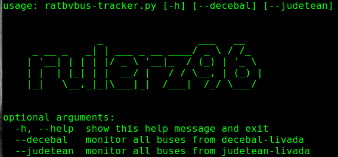

# RatbvBus-Tracker

This Application will help you monitor buses from RATBV in real time.

In other words, RatbvBus-Tracker will track every bus that will arrive in the selected station.

Currently, it has only two stations that I use every day.

Feel free to add each station that you will use.

## Logic behind it

- The ratbv data is scraped(collected) and parsed from the ratbv official website.

- The Application will update this data every 30 seconds to give the 'REAL-TIME' feeling.

## Dependencies

- To install python3 dependencies: ```pip3 install -r requirements.txt```

## Usage

For Help: ```python3 ratbvbus-tracker.py -h```



Exemple for 'Decebal station to Livada': ```python3 ratbvbus-tracker.py --decebal```


Exemple for 'Judetean station to Livada': ```python3 ratbvbus-tracker.py --judetean```


